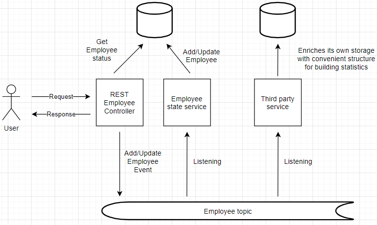

# Content
- [How to](#how-to)
- [Specs urls](#specs)
- [Second Part](#second)
- [Third Part](#third)

 </a> 

## How to

**Build:**
  go to project root directory and run in terminal

  Linux/Git Bash:

    sh build.sh
  windows:
  
    mvn clean install

**Run:**

  run in terminal or in Git Bash    

    sh run.sh

 </a> 

## Specs urls

    JSON: http://localhost:8081/v2/api-docs
    Swagger-ui: http://localhost:8081/swagger-ui/

 </a> 

## Second Part

Being concerned about developing high quality, resilient software, giving the fact, that you will be participating, mentoring other engineers in the coding review process.

- Suggest what will be your silver bullet, concerns while you're reviewing this part of the software that you need to make sure is being there.
- What the production-readiness criteria that you consider for this solution

>Review

- Project structure should conform to best practices having all layers supposed by it
- Code should following known best practises: SOLID, have abstraction layer, loosely coupled, readable, extendable, no code duplications etc.)
- Unit tests should be provided for main parts of application
- Easy to build, run, deploy, debug

>production-readiness

- All changes should be reflected in user stories and passed DoD conditions
- Changes passed all testing steps supposed by project rules: Unit, integration, automation, manual, e2e, performance, etc
- Solution is tested on security vulnerabilities
- Builds and deployments at all environments are done same way via CI/CD tools

 </a> 

## Third Part

Another Team in the company is building another service, This service will be used to provide some statistics of the employees, this could be used to list the number of employees per country, other types of statistics which is very vague at the moment.
- Please think of a solution without any further implementation that could be able to integrate on top of your service, including the integration pattern will be used, the database storage etc.
A high-level architecture diagram is sufficient to present this.

> Solution

In this solution same topic is used for all interested services which may fetch data and construct any convenient schema for doing their logic.

Another way is to add one more Kafka topic and push added employees there populating with any other data third party may be interested in.

